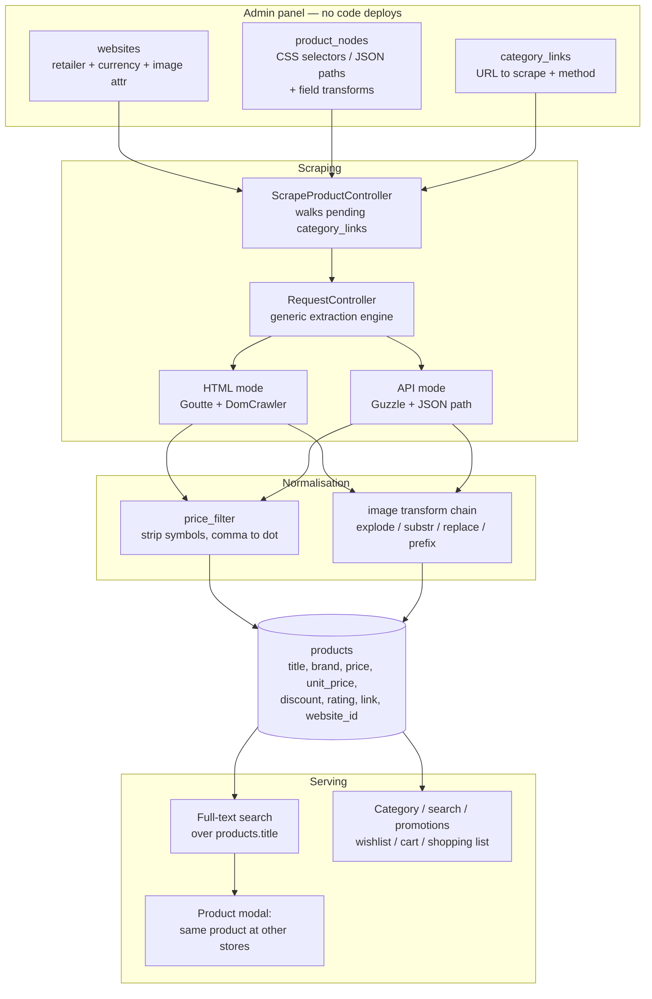

# Price Comparison Engine for Portuguese Grocery Retailers

Undergraduate final year project (2021). A web application that scrapes product listings from **16 Portuguese grocery retailers**, normalises them into a common schema, and lets a shopper find the cheapest place to buy a given product.

Built with Laravel 8 / PHP. The part worth reading is not the storefront — it's the **configuration-driven scraper**, which extracts products from structurally unrelated retailer sites without a line of per-site code.

---

## The problem

Portuguese grocery retailers — Continente, Auchan, Lidl, Aldi, Minipreço, Pingo Doce's competitors and a long tail of regional and organic stores — each publish their own catalogue at their own prices. The same product can differ substantially in price between them, and there is no single place a shopper can compare.

The obvious approach is to consume each retailer's product feed. None of them publish one. So the data has to be taken from the public storefronts, which creates the actual engineering problem:

> **No two retailers agree on anything.** Not the HTML structure, not the field names, not the price format, not how an image URL is written, and — most damagingly — not the product title. There is no shared identifier. The same 1kg bag of rice is a different string on every site.

Everything below follows from that.

## Architecture



### The idea that holds it together

A scraper for 16 sites is normally 16 scrapers. This one is a single extraction engine plus a **configuration row per retailer**.

The `product_nodes` table stores, per retailer, the CSS selector (or JSON path) for every field the system wants:

| Column | Example (Auchan) | Example (Comuniti) |
|---|---|---|
| `main_listing_node` | `.view-grid .product-item` | `.recipe_prod_add_to_cart` |
| `title` | `.product-item-header h3` | `.c-product__name` |
| `brand` | `.product-item-brand` | `.c-product__type` |
| `price` | `.product-item-price` | `.c-product__price .price` |
| `unit_price` | `.product-item-quantity-price` | `.c-product__price-perkg` |
| `product_link` | `.product-item-header a` | `.c-product__link-wrapper` |
| `product_url` | `https://www.auchan.pt` | *(links already absolute)* |

`RequestController::category_url_scrapper()` takes those selectors as arguments and applies them generically. **Adding a seventeenth retailer means inserting a row through the admin panel — no code change, no deploy.** That was the design goal and it is the part of the project I'd defend.

The same engine handles two fundamentally different source types:

- **HTML mode** — `fabpot/goutte` over Symfony's `DomCrawler`, applying the stored CSS selectors to the rendered listing page.
- **API mode** — Guzzle against a retailer's own JSON endpoint, where `main_listing_node` is a comma-separated path (`data,products,items`) walked by `parse_comma()` instead of a CSS selector. Mercadão is served this way, because it exposes a catalogue JSON endpoint and scraping its HTML would be strictly worse.

## Data challenges, and what was done about them

This is where the actual work was.

### 1. Price formats

Portuguese sites write prices as `1,99 €`, `€1.99`, `1.99€`, sometimes with non-breaking spaces or stray control characters from the CMS, and use **comma as the decimal separator**. Parsed naively, `1,99` becomes `199`.

`RequestController::price_filter()` strips currency symbols, removes every remaining non-numeric character except `,` and `.`, trims embedded control characters (`\0 \t \n \r \x0B`), and converts comma to dot before casting. Unglamorous, and it was the source of the longest-lived bug in the project — the commit history still carries `price bug solve`.

### 2. Image URLs, written six different ways

No two retailers reference images the same way. Some use `src`, Continente uses `data-original` (lazy loading), some emit a `srcset` list where the last entry is the one you want, some give relative paths needing a CDN prefix, some append sizing query parameters.

Rather than special-case each one, the config carries a small **transform chain** applied in order:

| Config field | What it does |
|---|---|
| `source` | which HTML attribute to read (`src`, `data-original`, …) |
| `explode` | split on `,` and take the last entry (unpacks `srcset`) |
| `substr` / `substr_strpos` | trim a fixed prefix, or everything after a marker |
| `str_replace` / `replace_with` | substitute a path segment (e.g. thumbnail → full size) |
| `image_url` | prepend a CDN or host prefix |
| `append_str` | append sizing parameters |

Each is a nullable column. A retailer that needs none of them leaves them all empty. It's a tiny declarative transform language expressed as table columns — crude, but it kept sixteen retailers on one code path.

### 3. Product matching — the hard one

**There is no shared identifier.** Retailers don't expose EAN/GTIN barcodes on listing pages. "The same product" exists only as a claim about two differently-worded titles:

```
Continente   Arroz Agulha Longo Continente 1kg
Auchan       ARROZ AGULHA AUCHAN 1 KG
Minipreço    Arroz Agulha 1Kg Minipreço
```

Different brand placement, different casing, different unit spacing, retailer name embedded in the title.

**What this project does:** matching is deferred to query time. There is no canonical product table. When a user opens a product, `ProductLists::getProduct()` takes that product's title and runs a relevance-ranked full-text search (`nicolaslopezj/searchable`, weighted on `products.title`) across all *other* products, returning the top 5 as "also available at". Price comparison is that list, sorted.

**Why it was done that way:** it requires no entity-resolution pass, no clustering step, and no maintenance as catalogues change — new products are comparable the moment they're scraped. For a 2021 final year project on a fixed timeline, it worked and it demonstrated the end-to-end system.

**Its honest limitations**, which I'd fix first if I returned to this:

- Title-token relevance conflates *similar* with *identical*. 1kg and 5kg of the same rice score nearly identically, and comparing their prices is meaningless.
- Retailer names inside titles inflate similarity between products from the same retailer and deflate it across retailers — precisely backwards for this use case.
- Nothing uses `brand` or `unit_price`, both of which are already scraped and both of which carry real matching signal. `unit_price` (price per kg/litre) is arguably the *correct* comparison axis and is the obvious next step.
- There is no confidence score, so the UI cannot distinguish a certain match from a guess, and a bad match is presented as a fact.
- Cost is O(catalogue) per product view, rather than an offline pass amortised across all views.

A better design is a canonical `product_groups` table populated offline — normalise titles (case, unit tokens, retailer-name stripping), block on brand and normalised quantity, then score within blocks and retain a match confidence. The current design trades that accuracy for zero build cost.

### 4. Everything else that doesn't line up

- **Brand** is a separate field on some sites, embedded in the title on others, absent on others. Stored when available, nullable otherwise.
- **Unit price** (per kg/litre) is published by the larger chains and not by the smaller ones.
- **Discounts** appear as `-20%`, `2ª unidade 50%`, or a struck-through price with no percentage at all. Stored as scraped text; not parsed into a comparable number.
- **Ratings** are a review count on one site and a favourites count on another. Both land in `rating`, which means the column is not comparable across retailers — a known wart.
- **Currency** is modelled as a table and foreign key on `websites`, so it generalises, though every retailer here is in EUR.

## What the application does

**Storefront** — home page with dynamic banners, sliders and advertising slots; category browsing with price-range filtering and pagination; search with live suggestions (Livewire); a product detail modal that surfaces the same product at other retailers with their prices; wishlist, cart and a persistent shopping list; best-promotions and top-rated pages; user profile and password management.

The cart is deliberately **not** a checkout. The application never sells anything — it links out to the retailer's own product page. Cart and wishlist persist to the database on login, having been held in session before it.

**Admin panel** — CRUD for retailers, scraper configurations (`product_nodes`), category links, products, categories, currencies, sliders, banners and advertising; role and permission management via `spatie/laravel-permission`; and a `scrape-products` action that walks every category link not yet marked `last_updated` and runs the extraction pipeline.

## Tech stack

| Layer | Choice |
|---|---|
| Framework | Laravel 8 (PHP 7.4+) |
| Scraping | `fabpot/goutte` + Symfony DomCrawler (HTML), Guzzle (JSON APIs) |
| Reactive UI | Laravel Livewire |
| Search | `nicolaslopezj/searchable` (title relevance), `spatie/laravel-searchable` |
| Media | `spatie/laravel-medialibrary` — product images downloaded and thumbnailed |
| Auth / access | Laravel Breeze, `spatie/laravel-permission` |
| Cart | `hardevine/LaravelShoppingcart` |
| URLs | `spatie/laravel-sluggable` |
| Frontend | Blade, Tailwind CSS, Laravel Mix |
| Database | MySQL |

## Running it

```bash
git clone https://github.com/abdulrehmandar2234/finalyearproject
cd finalyearproject

composer install
cp .env.example .env
php artisan key:generate
```

Set your database credentials in `.env`, and set `APP_URL=http://127.0.0.1:8000` — Spatie Media Library needs it to resolve asset URLs correctly.

```bash
php artisan migrate --seed    # schema + 16 retailers, their scraper configs, and demo data
npm install && npm run dev
php artisan serve
```

Open `http://127.0.0.1:8000`. The seeders populate retailers, `product_nodes` and two category links, but **no products** — trigger a scrape from the admin panel (`/scrape-products`) to populate the catalogue.

> **A note on running the scrapers today.** The selectors in `ProductNodesTableSeeder` were written against these sites as they existed in 2021. Retailer markup changes constantly, so several will no longer match and will return empty fields. That is the expected failure mode of any CSS-selector scraper and is itself part of what the project demonstrates — repairing a retailer is a config edit in the admin panel, not a code change.

## Repository layout

```
app/Http/Controllers/Admin/RequestController.php       the extraction engine (HTML + API modes)
app/Http/Controllers/Admin/ScrapeProductController.php orchestration: walks pending category links
app/Models/ProductNode.php                             per-retailer scraper configuration
app/Models/Product.php                                 normalised product; search config
app/Http/Livewire/ProductLists.php                     query-time cross-retailer matching
database/seeders/WebsitesTableSeeder.php               the 16 retailers
database/seeders/ProductNodesTableSeeder.php           their selector configurations
database/migrations/                                   schema
docs/FYP_Report.pdf                                    full project report
```

## Screenshots

*Not yet captured.* Running the storefront meaningfully needs a populated catalogue, which needs the 2021 selectors repaired first. Screenshots go in `docs/screenshots/` and get linked here when that's done.

## What I'd do differently

Writing this up years later, with the benefit of having since built production data pipelines:

- **Entity resolution belongs offline, not in the request path.** The query-time matching described above is the project's main structural weakness.
- **`unit_price` is the right comparison axis.** Comparing headline prices across a 1kg and a 750g pack is the wrong comparison, and the data to do it properly was already being collected.
- **Scraping should be queued, not synchronous.** `ScrapeProductController` runs inline with `ini_set('max_execution_time', 0)` and an admin waiting on an HTTP request. It should be a queued job per category link, with retries and a failure record.
- **Selector health needs monitoring.** Silent extraction failure is the characteristic failure mode here — `get_text()` returns `''` when a selector stops matching, and nothing notices. A per-retailer fill-rate check after each run would catch it immediately.
- **Scraped fields should be typed at the boundary.** `price` is a float but `discount`, `rating` and `unit_price` are all strings holding whatever the site printed, which pushes parsing into every consumer.

## License

MIT — see [LICENSE](LICENSE).

The scraper configurations reference publicly accessible retailer pages. This project was built for academic purposes; anyone reusing it is responsible for the terms of service and robots.txt of any site they point it at.
